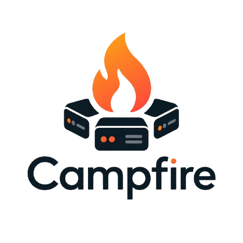

<p align="center">
  
</p>

<p align="center">
  A small, native desktop app for running and managing multiple local dev servers.
</p>

<p align="center"><b>English</b> · <a href="README_KO.md">한국어</a></p>

Start, stop, and restart servers written in any language or framework, watch
their logs live, and catch port clashes — all from one window. Built in Rust
with egui, so it's a single lightweight binary (~9 MB) with no runtime to
install.

## Features

- **Any server** — run anything via a shell command (`npm run dev`,
  `./gradlew bootRun`, `go run .`, …)
- **Presets** — Spring Boot, Flink, Next.js, Go, or a blank Custom entry that
  pre-fill the command and a default port
- **Per-server config** — working directory, port, environment variables, a
  `.env` file, and an optional shell override
- **Lifecycle** — start / stop / restart with whole-process-tree shutdown
  (graceful `SIGINT`, a grace period, then `SIGKILL`), so nothing is orphaned;
  press Stop again to force-quit immediately
- **Reorder** — drag project cards up or down to change their order; it's saved
- **Live logs** — ANSI colors rendered, plus search, follow (tail), and clear,
  over a bounded 5 MiB ring buffer
- **Port awareness** — warns when a port is already in use or assigned to two
  servers; injects both `PORT` and `SERVER_PORT`
- **Resource usage** — per-server CPU and memory shown live on each project
  card, summed over the whole process subtree
- **Cross-platform** — macOS and Windows
- **Local and private** — everything runs on your machine; config is a plain
  TOML file

## Requirements

- [Rust](https://www.rust-lang.org/tools/install) (stable)
- macOS or Windows

## Build and run

```sh
# run in development
cargo run

# build an optimized release binary (-> target/release/campfire)
cargo build --release
```

## Usage

1. Click **+ Add** and pick a preset (or Custom).
2. Set the **working directory** (Browse…) and the **command** to run.
3. Optionally set a port, environment variables, or a `.env` file.
4. Select the server and press **Start**. Watch the logs; **Stop** or
   **Restart** as needed.

The in-app **Help** button has the rest. A few notes:

- **Ports** — the port you set is injected as both `PORT` (Node/Next) and
  `SERVER_PORT` (Spring Boot). If your framework reads neither, put the port in
  the command (e.g. `--server.port=8080`) or an env var.
- **Shell / PATH** — commands run through your login shell. If a version
  manager (nvm, sdkman) isn't found, set the **Shell** field to `zsh -lic` so it
  sources `~/.zshrc`.
- **Config** — servers are saved under your OS app-config directory
  (`com.heonny.campfire/servers.toml`).

## Uninstall

Campfire keeps only two files — your server list (`servers.toml`) and its
running-state (`running.json`). Deleting the app leaves them behind; remove them
too for a clean uninstall.

| OS | Where they live |
|---|---|
| macOS | `~/Library/Application Support/com.heonny.campfire/` |
| Windows | `%APPDATA%\heonny\campfire\` and `%LOCALAPPDATA%\heonny\campfire\` |

The matching script clears them for you. It prints the paths and asks first;
pass `--yes` (macOS) or `-Yes` (Windows) to skip the prompt.

```sh
# macOS
./scripts/uninstall-macos.sh

# Windows (PowerShell)
.\scripts\uninstall-windows.ps1
```

Then remove the app itself: move **Campfire.app** to the Trash (macOS) or delete
the `campfire` binary (Windows). The scripts never touch the app — only its data.

## Built with

Rust · [egui / eframe](https://github.com/emilk/egui) · egui_extras · command-group ·
sysinfo · rfd

## License

The application code is under the MIT License — see [LICENSE](LICENSE).

The bundled [Pretendard](https://github.com/orioncactus/pretendard) font is
under the SIL Open Font License (`assets/fonts/Pretendard-LICENSE.txt`).

The [Lucide](https://lucide.dev) icons are under the ISC License
(`assets/icons/LICENSE`).
